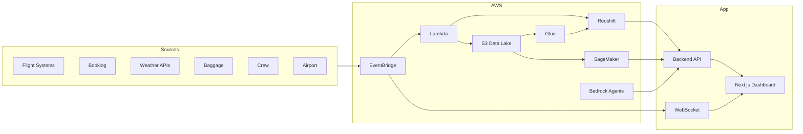

# Architecture

## System context



## Application layers

| Layer | Responsibility |
|-------|----------------|
| **Presentation** | Dashboards, maps, copilot chat, alerts UI |
| **API / BFF** | REST, WebSocket, RBAC, audit, orchestration |
| **Domain services** | Flights, crew, baggage, KPIs, alerts, predictions |
| **Ingestion** | Normalize events, validate schemas, publish to bus |
| **Data** | Bronze (raw) → Silver (curated) → Gold (KPI/features) |
| **Intelligence** | SageMaker models + Bedrock agents |
| **Platform** | VPC, IAM, secrets, monitoring |

## Canonical entities

See [DATA_MODEL.md](./DATA_MODEL.md). All pipelines use shared IDs:

- `flightLegId`, `aircraftRegistration`, `airportIata`, `crewMemberId`, `pnr`, `bagTagId`

## Event-driven flow

1. Source change → connector/Lambda → canonical event on EventBridge  
2. Rules fan out: S3 archive, Redshift upsert, cache update, alert evaluator, agent trigger  
3. Dashboard receives push via WebSocket from API subscription layer  

See [EVENT_CATALOG.md](./EVENT_CATALOG.md).

## Agent orchestration

```
User (Copilot UI)
    → Backend /copilot
        → Supervisor (route intent)
            → Specialist Agent (tools: query warehouse, run ML, list flights)
        → Audit log + optional human approval
```

Specialist agents live under `agents/`. Each agent has tools defined in `agents/shared/tools/`.

## Security zones

- **Public**: CloudFront + ALB (HTTPS only)  
- **App**: Private subnets — API, Lambda, agents  
- **Data**: Private subnets — Redshift, no public S3 buckets  

See [SECURITY.md](./SECURITY.md).
